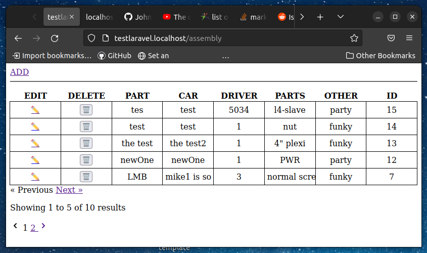
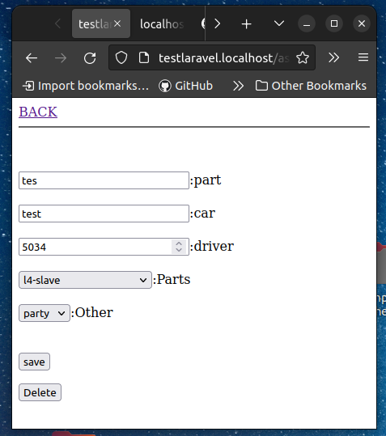
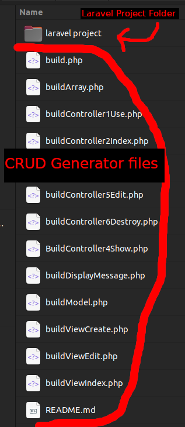
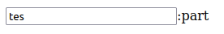
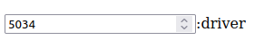

# laravel-crud-builder
This is a simple php script that will build a all CRUD views with a model and controller automaticly based on your database rows.

## What do you get from this php script?
You Can Genarate CRUD Model, View and Controller for your laravel 9 app.
it is a great starting point for any laravel project so that you dont need to do the labor intensive task of setting up crud for each table in your project.



You will have a php script that will easaly genarate your model view and controller with routes for a table in your database.

fill in a few details about your table and run the script and it will genarate all of the views for you that are connected to models and controllers for your table.

## How does it work?

### 1. place the php files just outside of your laravel 9 directory.



### 2. open the buildArray.php file and populate the array with the diteals about your table, and the collumns that are in your table.

#### $projectName
The $projectName variable is just the name of the folder that your laravel project files are inside. This is **just a folder name** **NOT a file path** because this project is expecting all of the php files to be sitting just outside of your laravel project folder.

#### $globalName
$globalName is used for the URL path. For exsample if you set this variable to billy to access the index page of billy CRUD, you would just go to your laravel domain and add "/billy" eg: ***http://laravelProject.localhost/billy***

#### $globalMaxNumberPerPage
The number of items that are shown on the index page for this CRUD (15) is a fine default value but I have seen people go as high as 50 or more.

#### $globalDatabaseName
You must change this variable to match the table name in your database.

#### $globalColumns
** $globalColumns is the most important part of this php script!**

$globalColumns is an array. 

Each item in this array represents a collumn in your database.

each item in the array is also an array that has more settings about each input.
for the purposes of this sccript we need to know a few things. about each array inside the $globalColumns array.

1. What is the name of the collumn in your table?
1. how will it be represented in the view? (Is it a text input, select dropdown or a number?)
1. is it a dropdown that is connected to another tabel

this is an exsample of a text input box in the view that is connected to the 'part' collumn in your table.

```
    [
        'type' => 'dbRow',
        'name' => 'part',
        'htmlInputType' => 'text'
    ],
```
the output of this will look like this in the view.



if you change it up a bit and have the input feild with an HTML type of number.
```
    [
        'type' => 'dbRow',
        'name' => 'driver',
        'htmlInputType' => 'number'
    ],
```

the output in the view will look like this.



As this project progresses I will add more types but as it sits right now there is only one other type and that is a **dropdown** selector that refrances another table for its dropdown list.
when type is set to selectList you need to provide some other peramitors.

- **name**: will become the headder on the index page.
- **htmlInputType**: this must be set to (select) for this to work properly.
- **databaseName**: this must be set to the name of the table that contains the list of dropdown items.
- **columnShown**: this must be set to the column name of what you want to apear visable in the dropdown.
- **IdCollumnForThisTable**: set this to a column name in your main table that contains the ID numbers of the selected list item.
eg: 
##### Main Table
| id | name  | hotelNumber |
|----|-------|-------------|
| 1  | bill  | 1           |
| 2  | Frank | 2           |

##### Dropdown List Table hotels
| id | hotel         |
|----|---------------|
| 1  | San Francisco |
| 2  | Alberta       |


```
    [
        'type' => 'selectList',
        'name' => 'hotels',
        'htmlInputType' => 'select',
        'databaseName' => 'hotels',
        'columnShown' => 'hotel',
        'IdCollumnForThisTable' => 'hotelNumber',
        'ForenIdColumn' => 'id'

    ],

```

in this cenario Frank would be accociated with Alberta and Bill would be accociated with San Francisco.

if we are than on the edit page for Frank there would be a dropdown selector that would show a list of all of the hotels in the hotel database. so you could pick San Francisco off of the dropdown list and save the changes and franks row would show a 1 in the hotelNumber column.

### 3. open the build.php file 
this php script must be run on a web server with php 8+ installed.
your laravel app is running inside a virtual host on your server but the php CRUD genarator is outside of the laravel folder so you need to access the root directory of your web server using a web browser. this means that if you dont have a virtual host set up for the root directory you may need to set one up to run the php script.

in your web browser go to the build.php file ``` http://localhost/build.php```

### 4. copy and paste the route shown on screen into the web.php routs file.
### 5. go to the url of your index route and you will see a fully interactive index of your database complete with create, edit and delete pages.

